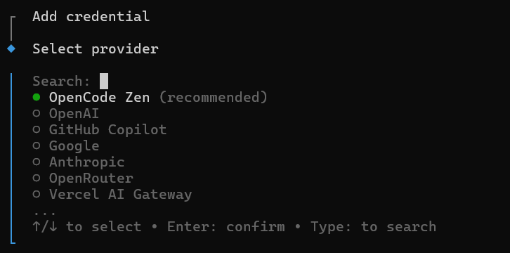

## Installation

### Windows

如果你没有使用过 WSL，按照以下命令初始化：

```bash
wsl --install -d Ubuntu-22.04
```

完成后，通过以下命令启动 WSL：

```bash
wsl
```

随后按照 Ubuntu 的安装向导进行安装

### Ubuntu

下载最新版本的 [Node.js](https://nodejs.org/zh-cn/download)，并安装

通过命令行安装 [OpenCode](https://opencode.ai/zh)：

```bash
npm i -g opencode-ai
```

## Configuration

告诉 Sisyphus (如果有的话)：

> 将仓库 https://github.com/Instinct323/EnvConfig.git 克隆到临时目录，按照其中的 .opencode/config-guide.md 配置环境

退出 `opencode`，通过以下命令进行身份验证：

```
opencode auth login
```



如果你准备了 `API_Key.md`，重启 `opencode`，继续告诉 Sisyphus：

> 依次完成以下步骤：
> - /more-provider 从 @API_Key.md 中获取 API Key 作为参数，进行配置。
> - /config-omo 配置